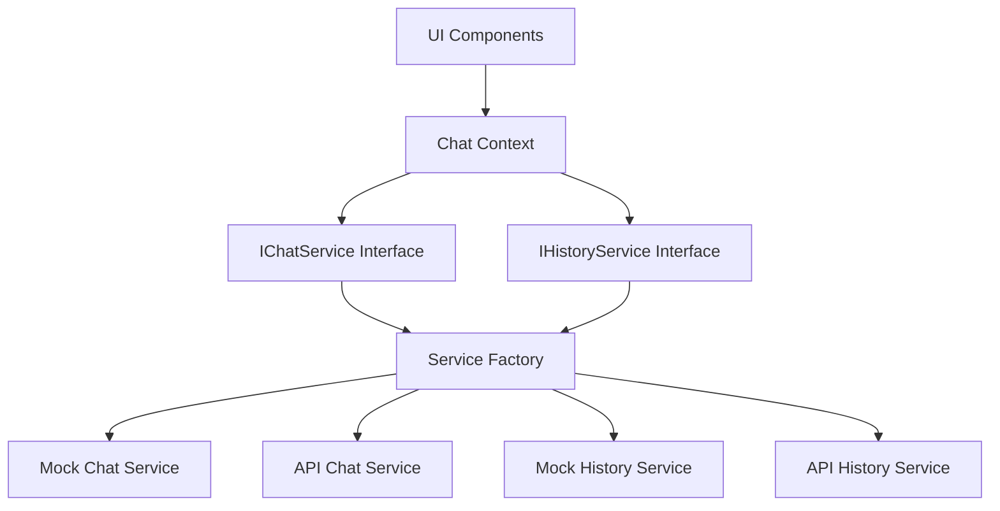

# Service Architecture

This document explains the service architecture of the Chat UI application, focusing on how the application interacts with APIs and manages state.

## Architecture Overview

The application follows a service-based architecture where UI components interact with services through interfaces. This allows for flexibility in implementation and easy switching between mock and real API services.



## Key Components

### Service Interfaces

The application defines clear interfaces for services:

- **IChatService**: Interface for sending messages and receiving responses
- **IHistoryService**: Interface for managing chat histories

### Service Factory

The `ServiceFactory` class is responsible for creating service instances based on environment variables:

```typescript
export class ServiceFactory {
  static createChatService(agentMode: AgentMode): IChatService {
    // Determine which service to create based on environment variables
    const mode = agentMode === 'standard' 
      ? getStandardChatMode() 
      : getMultiAgentChatMode();
    
    return mode === 'api' ? new ApiChatService() : new MockChatService();
  }
  
  static createHistoryService(): IHistoryService {
    const mode = getChatHistoryMode();
    return mode === 'api' ? new ApiHistoryService() : new LocalHistoryService();
  }
}
```

### Chat Context

The `ChatContext` provides a central place for managing chat state and interactions:

- Manages chat histories
- Handles sending messages
- Creates new chats
- Selects active chat
- Deletes chats

The context uses the service interfaces to interact with either mock or real API services without knowledge of the specific implementation.

## Service Implementations

### Chat Services

#### MockChatService

- Simulates responses locally
- Supports both standard and multi-agent chat
- Uses predefined patterns for responses
- Useful for development and testing

#### ApiChatService

- Makes actual API calls to endpoints specified in environment variables
- Handles streaming responses for multi-agent chat
- Processes both streaming and batch responses
- Includes error handling and retry logic

### History Services

#### LocalHistoryService

- Stores chat histories in browser localStorage
- Separates histories for standard and multi-agent chats
- Persists across browser sessions
- Useful for development and offline testing

#### ApiHistoryService

- Makes API calls to store and retrieve chat histories
- Interacts with the history API endpoint
- Syncs histories across devices
- Used in production environments

## Response Processing

### Standard Chat

For standard chat, the application:
1. Sends the complete message history to the API
2. Receives a single response
3. Adds the response to the chat history
4. Updates the UI

### Multi-Agent Chat

For multi-agent chat, the application supports two modes:

#### Streaming Mode
1. Sends the message history to the API with streaming headers
2. Processes each agent response as it arrives
3. Updates the UI in real-time as responses come in
4. Applies different styling to each agent's messages

#### Batch Mode
1. Sends the message history to the API
2. Receives a complete chat history with multiple agent responses
3. Processes each agent response in the array
4. Updates the UI with all responses at once

## Key Design Patterns

### Factory Pattern

Used in `ServiceFactory` to create appropriate service instances based on configuration.

### Strategy Pattern

The use of interfaces allows different implementations (strategies) for the same behavior.

### Provider Pattern

Used with React Context to make services available throughout the component tree.

### Observer Pattern

The `useEffect` hooks in various components observe state changes and react accordingly.

## Example Flow

1. User sends a message
2. `ChatContext` calls `sendMessage` on the current `IChatService` instance
3. The service (either mock or API) processes the message
4. The service returns a response (or multiple responses for multi-agent chat)
5. `ChatContext` updates its state with the new message(s)
6. The UI components react to the state change and update 